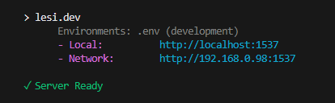

# github.com/lesi97/goconsole

## Installation

Firstly, in your terminal run:

```bash
go get github.com/lesi97/goconsole
```

Then import into your package:

```go
import "github.com/lesi97/goconsole"
```

## Usage

2 functions are available in this package:

-   PrintColour
-   Startup

### PrintColour

PrintColour allows you to print to the console similarly to the `fmt.printf()` function however you can specify an ANSI variable too :)
Example:

```go
import "github.com/lesi97/goconsole"

func init() {
	goconsole.PrintColour("blue", "Obi-Wan: Hello there\n")
	goconsole.PrintColour("red", "Grievous: %v %v", "General", "Kenobi")
}
```

Allowed values for Colours(And other ANSI codes) can be found below:

##### Base colours:

| Name    | Value   |
| ------- | ------- |
| Black   | black   |
| Red     | red     |
| Green   | green   |
| Yellow  | yellow  |
| Blue    | blue    |
| Magenta | magenta |
| Cyan    | cyan    |
| White   | white   |

##### Bright colours:

| Name           | Value         |
| -------------- | ------------- |
| Bright Black   | brightBlack   |
| Bright Red     | brightRed     |
| Bright Green   | brightGreen   |
| Bright Yellow  | brightYellow  |
| Bright Blue    | brightBlue    |
| Bright Magenta | brightMagenta |
| Bright Cyan    | brightCyan    |
| Bright White   | brightWhite   |

##### Text styles:

| Name      | Value     |
| --------- | --------- |
| Reset     | reset     |
| Bold      | bold      |
| Dim       | dim       |
| Italic    | italic    |
| Underline | underline |
| Blink     | blink     |
| Invert    | invert    |
| Hidden    | hidden    |

### Startup

This function will output relevant data to the terminal if in development mode (default)

The development check is checking your environment variables, if using something like `"github.com/joho/godotenv"` you will need to first load your variables in an `init` function

The name of your Go module will also be output to the terminal

```go
package main
import (
    "github.com/lesi97/goconsole"
    "github.com/joho/godotenv"
	"time"
)

func init() {
	err := godotenv.Overload()
	if err != nil {
		panic(".env file not loaded")
	}
    goconsole.Startup()
}

func main() {
    goconsole.PrintColour("brightMagenta", "Tell somebody you love them ❤️\n" )
    time.Sleep(10 * time.Second)
}
```

## Why this exists?

I'm learning [Go](https://go.dev/) and I wanted to try creating a package 😔

Plus I like having a startup screen with colours 🙂

I tried to make it reminiscient of the [NextJS](https://nextjs.org/) startup terminal



## "You spelled `Color` wrong"

No I didn't, you did 😖
